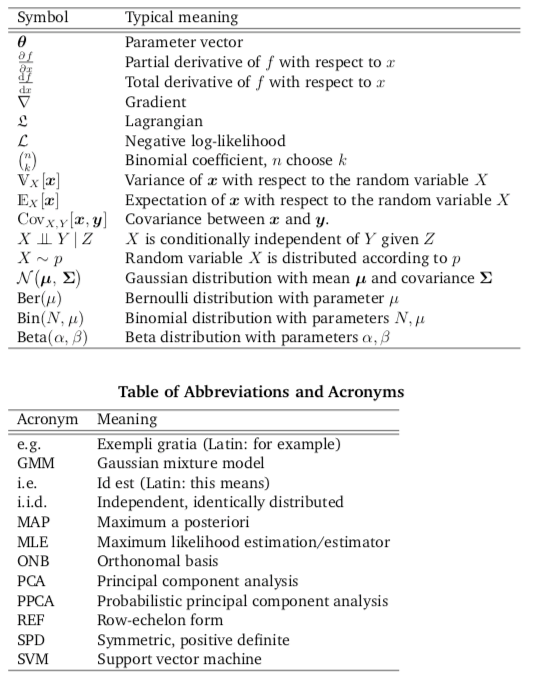

- Chapter 2: Linear Algebra
    - $\in$ means part of a set
        - Ex. $1 \in \{1,2,3\}$ means 1 is part of the set {1,2,3}
    - $\mathcal{G}$ means group
    - $\exists$ means exists
    - $\forall$ means for all