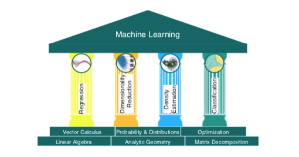

# Introduction and Motivation

- Machine learning is about designing algorithms that *automatically* extract valuable information from data
    - Emphasis on automatic because machine learning is concerned about general-purpose methodologies that can be applied to many datasets
    - Ideally, machine learning does not need domain-specific expertise
- Three concepts at the core of machine learning:
    - Data
    - Model
    - Learning
- *Data* is at the core of machine learning as it is a data driven method
- *Models* are said to learn from data if its performance on a given task improves after the data is taken into account
- The goal is to find good models that generalize well to yet unseen data
- *Learning* can be understood as a way to automatically find patterns and structure in data by optimizing the parameters of the model

## Finding Words for Intuitions

- Alorithm can be used in two contexts:
    - Maching learning algorithm to mean a system that makes predictions based on input data
        - These algorithms can be referred to as *predictors*
    - Machine learning algorithm to mean a system that adapts some internal parameters of the predictor so that it performs well on future unseen input data
        - These algorithms are referred to as *training systems*
- This book assumes that data has already been converted into a numerical representation suitable for computer programs
- Data is thought of in vectors, which has three different ways they can be viewed:
    - Array of numbers (computer science view)
    - An arrow with a direction and magnitude (physics view)
    - An object that obeys addition and scaling (mathematical view)
- A *model* is used to describe a process for generating data similar to the dataset at hand (or input data)
    - A good model can be used to predict what would happen in the real world without performing real-world experiments
- *Training* a model means to use existing data to optimize some parameters of the model with respect to a utility function that evaluates how well the model predicts the training data
- The main concepts of the book:
    - Data is represented as vectors
    - An appropriate model is chosen using either the probabilistic or optimization view
    - We learn from available data by using numerical optimization methods with the aim that the model performs well on data not used for training

## Two Ways to Read This Book

- Bottom-up: building up the concepts from foundational to more advanced (preferred approach)
- Top-down: drilling down from practical needs to more basic requirements
- Book is split into two parts:
    - Part 1 lays the mathematical foundations
    - Part 2 applies the concepts from Part 1 to a set of fundamental machine learning problems
- The four pillars of Machine Learning:
    - Regression
    - Dimensionality Reduction
    - Density Estimation
    - Classification
    - 
- The study of vectors and matrices is called *linear algebra*
- The construction of similarity and distances is central to *analytic geometry*
- Quantification of uncertainty is the realm of *probability theory*
- *Vector calculus* finds parameters that maximize some performance measure done to train machine learning models
    - Gradients tell use the direction in which to search for a solution
    - *Optimization* is to find the maxima/minima of functions